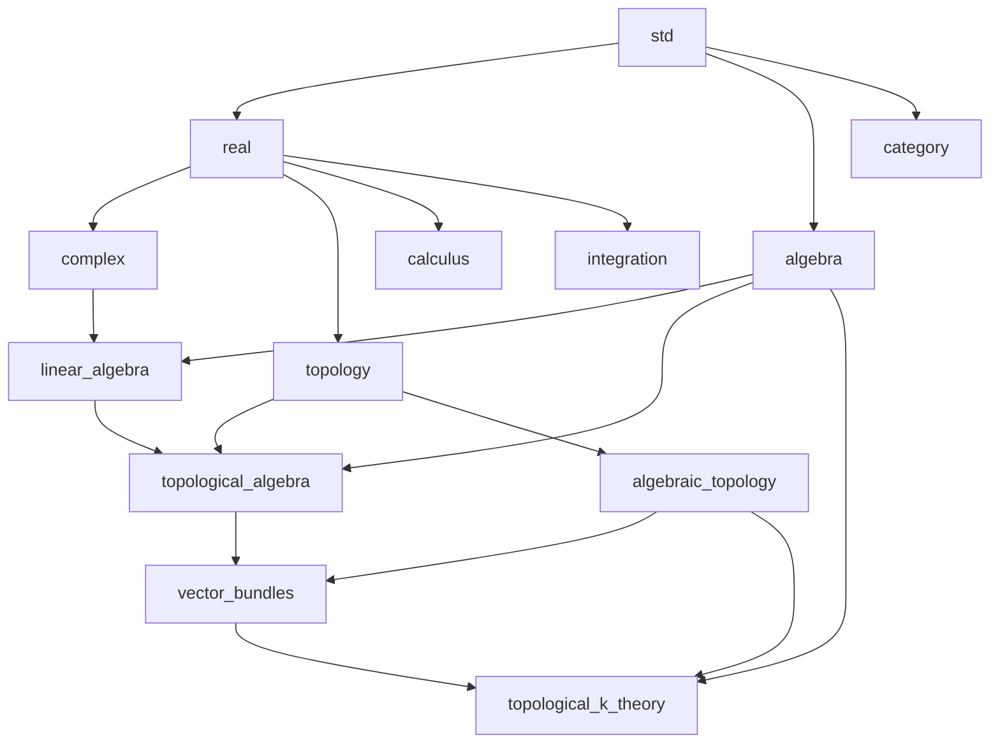

# 位相的 K 理論までのライブラリ構成

## 目標と規模

複素ベクトル束による \(K^0\) の構成から始め、有限 CW 対上の複素位相的 K 理論、Bott の 2 周期性、球面の K 群の計算までを中心目標とする。
\(K^0\) と基本積定理はコンパクト Hausdorff 空間上で整備し、相対群と完全列は有限 CW 対から始める。
実 K 理論 \(KO\)、特性類、Chern 指標、一般の CW 空間への拡張は、その先の到達点として担当を定める。

推奨する分割は、既存 8 パッケージの拡張と次の新規 5 パッケージで、合計 13 パッケージである。

| 新規パッケージ | 担当 |
| --- | --- |
| `algebra` | 準同型、商代数、群完成、多項式、完全性の代数的な部分 |
| `topological_algebra` | 位相と代数の接続、有限次元空間・行列の連続性、近似とスペクトル分離 |
| `algebraic_topology` | ホモトピー、基点付き空間、cone・suspension・cofiber、CW 対 |
| `vector_bundles` | ベクトル束、引き戻し、束演算、局所自明化、貼り合わせ、安定化 |
| `topological_k_theory` | \(K^0\)、相対 K 群、積、完全列、Bott 周期性、具体的計算 |

パッケージ数は数学的な仕事量の尺度としては粗い。
以下の範囲は、証明する主題を module 群に分けた設計上の概算であり、実装済みの定理数からの外挿ではない。

| 到達点 | 必要な厚み | パッケージ構成 |
| --- | --- | --- |
| A: コンパクト Hausdorff 空間の \(K^0\) 環と反変性 | 商・群完成、有限次元線形代数、コンパクト性、束の構成と演算 | 新規 4 個で着手できる。`algebraic_topology` は次の段階で追加する。 |
| B: ホモトピー不変性、相対群、負次数の完全列 | 区間上の束、cofiber、有限 CW 対、相対化と貼り合わせ | 新規 5 個がそろい、全体で 13 個。 |
| C: Bott 周期性と球面の計算 | 円周上の近似、連続な行列族の分解、基本積定理、次数の周期化 | B と同じ分割を保ち、各ライブラリの証明を大幅に拡充する。 |
| D: Chern 指標と通常のコホモロジーによる計算 | 鎖複体、特異・胞体コホモロジー、特性類、有理化 | `homological_algebra`、`cohomology`、`characteristic_classes` を加え、全体で 16 個を目安にする。 |
| E: 実 K 理論、同変理論、指数定理 | Clifford 代数、表現論、解析など、選ぶ方向に対応する追加理論 | 下記の拡張表に従って個別に分割する。 |

A から C までで、既存パッケージへの追加を含めて 65〜110 程度の主題別 module 群を見込む。
`Def` / `Prop` の分離や補題の分割によって、実際の `.ref` ファイル数はこれより増える。
日数・行数の見積もりは、束の表現と最初の非自明な構成を型検査した後に更新する。

## 現在の土台

調査基準は 2026-10-06、コミット `506cf0b` のソースと各 README である。
`libs/` には 261 個の `.ref`、約 3.5 万行がある。
以下の「既存」は宣言・実装の所在を確認した範囲を指し、この計画作成時の全ライブラリ再検査を意味しない。

| 既存パッケージ | 再利用する部分 | K 理論に向けた主要な追加 |
| --- | --- | --- |
| `std` | 論理、有限集合、商、整数・有理数、群・環・体・加群の構造 | 有限添字・集合族・商の共通操作、一般構成から使いやすい基本補題 |
| `real` | Dedekind 実数、Cauchy 実数、完備性、距離、数列 | 平方根、有限和の評価、幾何級数、近似に使う実数の評価 |
| `complex` | 実数対による複素数、体、共役、絶対値の二乗 | 絶対値と評価、有限次元解析で使うスカラーの補題 |
| `linear_algebra` | 線形写像、核、有限基底、行列表示、基底変換、トレース、内積 | 次元定理、直和・双対・テンソル積、行列式・逆行列、直交化、多項式作用 |
| `topology` | 連続写像、積・部分空間、距離位相、分離性、Urysohn 補題、距離化 | コンパクト性の諸定理、商・貼り合わせ、有限従属分割、区間・球面に必要な基礎 |
| `category` | 圏、関手、自然変換、普遍性、極限、随伴 | 各分野の具体的な圏・関手から利用する共通 API |
| `calculus` | 極限・微分・多変数微分の定義と基本例 | 滑らかな束・多様体・微分形式へ進む段階の基礎 |
| `integration` | 区間上のリーマン積分、\(L^1\) 完備化 | 積分を使う近似の証明経路や、Chern–Weil 理論へ進む段階の基礎 |

特に `topology.Topology` には既に `IsCompact` / `IsCompactIn` の定義がある。
ここで必要な仕事は、コンパクト性の保存、コンパクト Hausdorff 空間の正規性、有限被覆の縮小などの定理をそろえることである。
既存の `Normality` は正則かつ第二可算な空間の正規性を扱っているため、コンパクト Hausdorff 空間から正規性を得る経路を追加する。
同様に、固有値や内積の定義があることと、連続な行列族のスペクトル分解が使えることは別の到達点である。

## 各ライブラリの担当範囲

### `std` と `algebra`

`std.Alg` は、他分野が共通して使う構造の定義と、その基本的な法則を担当する。
`algebra` は、構造を入力として新しい代数的対象を作る一般構成を担当する。
この分割なら、実数・複素数の構成に必要な小さな代数的基礎を `std` に保ちながら、K 理論向けの抽象代数を独立に増やせる。

予定する module 群は `Hom`、`Quotient`、`GroupCompletion`、`Exact`、`Polynomial`、`LaurentPolynomial` である。
後続の需要に応じて、有限生成射影加群、外積代数、Clifford 代数を同じパッケージ内に追加する。
ベクトル空間のテンソル積は `linear_algebra`、一般の環上の加群のテンソル積は `algebra` が担当し、前者は後者の具体化と接続する。

可換モノイド \(M\) の群完成は、\(M\times M\) 上の次の関係から構成する。

\[
(a,b)\sim(c,d)
\quad\Longleftrightarrow\quad
\exists e\in M,\quad a+d+e=c+b+e.
\]

この定義で一般の可換モノイドを扱い、可換群への準同型を一意に延長する普遍性を証明する。
可換半環に対しては積を降ろし、環としての普遍性まで提供する。
既存の整数の形式差との同型は、一般構成の最初の具体例になる。
核・像・完全性は `algebra.Exact` にまとめ、K 理論の完全列もこの語彙を使う。

### `topology`

点集合位相として表現できる構成と定理を担当する。
主な追加は `Compactness`、`Quotient`、`Gluing`、`Homeomorphism`、`PartitionOfUnity`、`FunctionSpace`、`LocallyCompact` である。
コンパクト集合の連続像、閉部分集合、有限積、tube lemma、実数区間のコンパクト性、コンパクト Hausdorff 空間の正規性をそろえる。
有限開被覆に従属する分割では、非負性・和が 1・台の包含を一つの構造として扱う。

区間、部分空間、商位相、有限貼り合わせはこの層から公開する。
球面の座標モデルに必要な有限積の位相も、この層の構成を使う。
球面のホモトピー的な使い方と CW 構造は `algebraic_topology` に置く。
局所有限被覆とパラコンパクト性は、一般の CW 空間や非コンパクトな底空間上の束へ広げる段階で整備する。

### `real`、`complex`、`linear_algebra`

`real` と `complex` は、構成済みの数体系とその演算・順序・評価を担当する。
`linear_algebra` は、体上の空間と写像の代数的構成を担当する。
基底を含む表示データと、有限次元性そのものを分け、束の各ファイバーに大域的な基底を要求せずに使える API を整備する。

追加の中心は、有限次元空間の同型、次元の不変性、直和、双対、テンソル積、行列式、逆行列、Gram–Schmidt、Cayley–Hamilton である。
外積と行列式束への接続は、特性類や K 理論の演算を増やす段階に続く。
多項式環と多項式の互除法は `algebra`、行列への多項式の代入と核の分解は `linear_algebra` に置く。

### `topological_algebra`

位相空間と代数構造を同時に使う定理の受け皿にする。
`Topology`、`FiniteDimensional`、`Matrix`、`ClassicalGroups`、`Approximation`、`PolynomialRoots`、`SpectralSeparation` を主な module 群とする。
\(\mathbb R\)、\(\mathbb C\)、有限次元座標空間に既存の位相を与え、加法・乗法・共役・逆行列・行列式などの連続性を証明する。
\(GL_n(\mathbb C)\) の開性、\(U(n)\)、連続な直交化、射影行列と部分空間の対応を提供する。

Bott の証明に向けて、コンパクト空間上の関数の一様近似と、スペクトルが単位円を避ける行列族の連続な部分空間分解を整備する。
ここで扱うのはスカラー関数・行列・部分空間であり、それを束に貼り合わせる定理は `vector_bundles` が担当する。
複素多項式の根の存在や係数変化に対する根の集まりの連続性も、位相的な証明を用いる部分をこの層に置く。
`complex` はスカラーの演算を提供し、この上位層が解析的な性質を証明するという依存方向にする。

### `algebraic_topology`

`Homotopy`、`Pointed`、`Cylinder`、`Cone`、`Suspension`、`Smash`、`Cofibration`、`CW` を中心にする。
連続写像のホモトピー、相対ホモトピー、ホモトピー同値、基点付き構成、ホモトピー拡張性を担当する。
有限 CW 対について、部分複体の包含、商空間、セルの付着を扱えるようにする。
円周・球面・円板と、それらの suspension や貼り合わせによる表示を結び付ける。

一般の cofiber 列と Puppe 列はこのライブラリの構成であり、それに K 群を適用して完全列を得る定理は `topological_k_theory` の担当である。
有限 CW 対を入力にする最初の相対理論から、コンパクトな良い対や一般 CW 対へ対象を広げる。
Grassmannian 自体は `topological_algebra`、普遍束と束の分類は `vector_bundles`、一般的な分類空間の機構はこのライブラリに置く。

### `vector_bundles`

底空間、全空間、射影、ファイバーの線形構造、局所自明化をまとめた束を定義する。
公開 API は束そのものを受け取り、座標表示や埋め込みの選択は内部で比較できる補助データにする。
有限ランクは点ごとの局所定数なランクとして扱い、非連結空間の異なる成分でランクが変わる場合も含める。

担当する主題は次のとおりである。

| module 群 | 提供する構成・定理 |
| --- | --- |
| `Bundle` / `Morphism` / `Isomorphism` | 束、束写像、束同型、同型による移送 |
| `Trivial` / `LocalTrivialization` / `Transition` | 自明束、局所表示、遷移関数と cocycle |
| `Pullback` / `Restriction` | 引き戻し、制限、恒等写像・合成との整合性 |
| `DirectSum` / `Tensor` / `Dual` | Whitney 和、テンソル積、双対と構造同型 |
| `Gluing` / `Clutching` | 局所データからの構成、円板の境界に沿う貼り合わせ |
| `Metric` / `Complement` | Hermitian 計量、自明束への埋め込み、補束 |
| `Homotopy` / `Stable` | ホモトピックな写像による引き戻しの同型、安定同型 |
| `Presentation` / `IsomorphismClass` | 集合に収まる表示、表示によらない同型類、演算の降下 |
| `Grassmannian` / `Universal` | tautological bundle、後続の分類定理への接続 |

主要な中間目標は、コンパクト Hausdorff 空間上の任意の有限ランク複素束が、ある自明束の直和因子になること、区間方向の引き戻しが束の同型類を変えないことの二つである。
前者は有限従属分割と線形代数、後者は局所自明性・コンパクト性・貼り合わせを使って証明する。
個々の束演算の法則は束同型として証明し、同型類上で対応する等式を得る。

### `topological_k_theory`

`K0` は束の同型類の直和モノイドに `algebra.GroupCompletion` を適用する。
束のテンソル積から環構造を得て、引き戻しから反変性と自然性を証明する。
`Reduced` は基点への制限の核、`Relative` は有限 CW 対の商空間を使って構成する。

\[
\widetilde K^0(X)=\ker\bigl(K^0(X)\longrightarrow K^0(\{x_0\})\bigr),
\qquad
K^{-n}(X,A)=\widetilde K^0\bigl(\Sigma^n(X/A)\bigr)
\quad(n\geq 0).
\]

\(A=\varnothing\) の場合は基点を付加した \(X_+\) を使う。
基点を持つ非連結空間でも reduced 群はこの核として定義し、ランクは局所定数な整数値関数として別に扱う。

`Exact`、`MayerVietoris`、`Product`、`Bott`、`Computations` を順に整備する。
相対群には、商空間による表示と、束と部分空間上の自明化・同型を用いる表示との比較を用意する。
この比較が境界写像や完全性の証明を支える。
周期化後は全整数次数の理論、積の符号規則、6 項完全列を公開する。

## 依存方向

矢印は「基礎を提供する側 → 利用する側」を表し、既存の直接依存の細部を省略している。

`vector_bundles` から `algebraic_topology` への依存は、束のホモトピー不変性を実装する段階で加わる。
各分野の圏・関手の実装は利用側に置き、必要なパッケージが `category` を直接依存に加える。
全空間を対象とする大きな圏の表現は、現在の `category` の対象集合を持つ圏とは別に設計する。
まず固定した対象集合を持つ空間の族について関手を構成し、一般の空間に対しては引き戻しの恒等則・合成則を直接量化して証明する。

`calculus` と `integration` の利用範囲は証明経路に応じて決まる。
下記の近似経路を採用する場合、中心目標の直接の土台は既存の `std`、`real`、`complex`、`linear_algebra`、`topology` と新規 5 個であり、圏としての公開 API に `category` が加わる。

## Bott 周期性の証明経路と追加コスト

参照する基本経路は、束の clutching 表示から基本積定理を証明し、相対化して Bott 周期性を得るものである。
Hatcher の [Vector Bundles & K-Theory, §2.1–2.2](https://pi.math.cornell.edu/~hatcher/VBKT/VB.pdf) では、Laurent 多項式による近似、安定化による線形化、スペクトルによる束の分解が証明の核になる。
同書の近似補題は積分と Poisson 核を使うため、その証明を採用するなら既存の積分ライブラリにも追加が必要になる。

このリポジトリでの第一案は、近似部分を Stone–Weierstrass 型の証明に置き換え、次のように責任を分ける設計である。
これは上記の参考書に書かれた実装計画ではなく、依存関係を整理するための提案である。

| 必要な成果 | 所属 | 先にそろえるもの |
| --- | --- | --- |
| コンパクト Hausdorff 空間上の実・複素 Stone–Weierstrass 型近似 | `topological_algebra.Approximation` | 実数の多項式近似、絶対値の近似、有限部分被覆、連続関数の一様ノルム |
| \(X\times S^1\) 上の Laurent 多項式近似 | `topological_algebra.Approximation` | 連続係数の Laurent 多項式が定数を含み、点を分離し、共役で閉じること |
| 複素多項式の根の存在と分離された根群の連続性 | `topological_algebra.PolynomialRoots` | 代数学の基本定理の証明、根の有界性、重複度を含む有限多重集合と係数の対応 |
| 単位円を避けるスペクトルの連続分解 | `topological_algebra.SpectralSeparation` | 多項式の互除法、Cayley–Hamilton、上記の根群の連続性 |
| 束の自己準同型の近似と部分束への分解 | `vector_bundles` | 局所自明化、有限従属分割、行列版の成果 |
| clutching の安定線形化と基本積定理 | `topological_k_theory.Bott` | 束のホモトピー不変性、ブロック行列、上記の分解 |

根の連続性は重複する根も含めた根の集まりとして証明し、分離された二つの根群から因子多項式を連続に取り出す。
この段階の難しさを見積もりに含める。
積分による近似を採用する案とは、最初の近似補題の実装時に比較し、変更する場合は依存先と必要定理の表も更新する。

基本積定理の到達点は、Hopf 線束から定めた \(u=[H]-1\) による自然な環同型である。

\[
K^0(X)[u]/(u^2)\cong K^0(X\times S^2).
\]

そこから Bott 元 \(\beta\in\widetilde K^0(S^2)\) との外積による自然な同型

\[
\widetilde K^0(X)\xrightarrow{\;\beta\,\smile\,-\;}
\widetilde K^0(S^2\wedge X)
\]

を証明する。
球面だけの群の値に加え、写像に対する自然性と相対理論への整合性までを周期性の完了条件とする。
この基本積定理から周期性を導く流れと定理の対象範囲は、上記 [Hatcher, Theorems 2.2 and 2.11](https://pi.math.cornell.edu/~hatcher/VBKT/VB.pdf) に対応する。

## 集合としての束の同型類と処理系の確認

この計画で最初に具体化する設計問題は、\(\operatorname{Vect}_{\mathbb C}(X)\) を `\Set` として作る方法である。
関連型として全空間を持つ signature は束の自然な API になるが、その宣言だけで任意の全空間を持つ束全体が一つの集合に収まるわけではない。
現在の商 API は台集合を受け取るため、商を取る前に集合に収まる表示を構成する。

コンパクト Hausdorff 空間については、次の方式を第一案とする。

1. 固定した \(X\) と \(N\) に対して、自明束 \(X\times\mathbb C^N\) の連続な射影行列で表される部分束を集合として構成する。
2. 自然数 \(N\) にわたる表示をまとめ、異なる \(N\) の表示の間にも束同型を表す関係を定める。
3. 任意の有限ランク束がその表示を持つことを、Hermitian 計量と自明束への埋め込みから証明する。
4. 表示の集合を束同型で割り、直和・テンソル積・引き戻しが表示選択によらないことを証明する。

ランクは射影の像の次元で表し、非連結な底空間上のランク変化も許す。
同型類を作る段階の関係は束同型であり、安定化は群完成との比較を行う後続段階で導入する。
引き戻しの合成など、signature 全体の等式が扱いにくい箇所は具体的な束同型を構成して、その同型類の等式へ移す。

既存の [gaps](gaps.md) と [最小比較の結果](fix-md/README.md) では、G05 の依存する部分集合型、G06 の内部型の具体化、G07 の signature の受け渡しが、この表現に関係する。
それらの結果を現在の処理系で再確認し、射影表示・商・引き戻しを接続する小さな利用例を最初に検査する。
今回の計画段階では、この束の表現全体の型検査可能性は未確認である。
新たな表現上の問題が確認された場合は、書きたい API と最小例を `gaps.md` に追加し、必要な処理系修正を対応する実装計画に含める。

定理は対象と数学的条件を命題内で量化した形で公開する。
たとえば束の補束の存在は、底空間・位相・束について量化し、コンパクト Hausdorff 条件から存在命題を証明する。
構造の法則を保持する field と、その構造に対して新たに証明する補束・分類・周期性の定理を区別する。
構成のデータと法則は `\structure` にまとめ、計算を提供する箇所では `\machine` と `\correspondence` で数学的仕様に接続する。

## 実装順と各段階の完了条件

各段階は、定義、構成、主要定理、利用例がそろう単位として個別の実装計画に切り出す。

| 段階 | 作業 | 完了条件 |
| --- | --- | --- |
| 0 | 束の signature、射影表示、商への受け渡しを具体化する。 | 異なる ambient 次元の表示を比較でき、引き戻しと同型類を接続する最小例が型検査を通る。 |
| 1 | `algebra` の群完成と準同型・商の基礎を作る。 | 普遍性を証明し、自然数の群完成と既存の整数の同型を構成する。 |
| 2 | コンパクト性、有限従属分割、有限次元代数、位相との接続を整える。 | コンパクト Hausdorff 空間上の有限被覆に対する分割、連続な行列演算と局所的な部分空間表示を利用できる。 |
| 3 | 束、束演算、補束、集合に収まる同型類を作る。 | 任意の対象範囲内の束の射影表示、表示の独立性、束演算と引き戻しの整合性を証明する。 |
| 4 | \(K^0\) 環と反変性を作る。 | \(K^0(\mathrm{pt})\cong\mathbb Z\)、有限離散空間の計算、直和・テンソル積・引き戻しの法則を証明する。 |
| 5 | ホモトピー、有限 CW 対、相対群、負次数を整える。 | 束のホモトピー不変性、商表示と相対束表示の比較、境界写像と負次数の長完全列を証明する。 |
| 6 | 近似、根群の連続性、スペクトル分離を証明する。 | コンパクトなパラメータを持つ clutching を近似・分解でき、ホモトピーとの両立を証明する。 |
| 7 | 基本積定理から Bott 周期性を証明する。 | 自然な Bott 同型、相対化との整合性、全次数の理論と 6 項完全列を得る。 |
| 8 | 基本例と分野間 API を仕上げる。 | 球面の K 群を計算し、有限 CW 空間を完全列で扱う例、圏・関手としての利用例を通す。 |

球面についての最終的な確認例は、\(m\geq0\) に対する次の群同型である。

\[
\widetilde K^0(S^{2m})\cong\mathbb Z,
\qquad
\widetilde K^0(S^{2m+1})=0,
\qquad
K^{-1}(\mathrm{pt})=0.
\]

偶数次球面では Bott 元の反復積と生成元との対応まで示す。
Hopf 線束の構成と \(S^2\) の環構造は、基本積定理を具体例に接続する確認になる。
空空間・零ランク・非連結空間も、構成の適用範囲を確認する例に含める。

## 作業量の内訳

下表は A から C の範囲で追加・大幅拡充する主題別 module 群の目安である。
既存のファイルへの補題追加も一つの主題として数え、`Def` / `Prop` による物理的な分割は数に含めない。

| 分野 | 主題別 module 群の目安 | 見積もりを左右する部分 |
| --- | --- | --- |
| `std`・実数・複素数の補強 | 3〜6 | 有限添字、平方根、近似の実数評価 |
| 抽象代数 | 6〜10 | 一般の群完成、多項式と商の API |
| 一般位相 | 10〜16 | コンパクト性、商、有限従属分割 |
| 有限次元線形代数 | 6〜10 | 基底に依存しない構成、テンソル積、次元定理 |
| 位相と代数の接続 | 10〜18 | 一様近似、代数学の基本定理、根群と部分空間の連続性 |
| ホモトピーと CW 対 | 8〜14 | 商空間とホモトピー拡張性 |
| ベクトル束 | 12〜20 | 表示の比較、貼り合わせ、補束、ホモトピー不変性 |
| K 理論 | 10〜16 | 相対化、完全性、基本積定理、自然性 |
| 合計 | 65〜110 | 処理系の表現能力と共通補題の再利用性 |

特に重いのは、束の局所データの貼り合わせ、コンパクト性を使う大域化、Bott の証明に必要な解析的補題である。
群完成と \(K^0\) の定義は、この全体の中では比較的小さい部分になる。
段階 0、3、6 の完了時に、表示方法・補題の粒度・型検査時間を測って見積もりを更新する。

## その先のライブラリ分け

| 発展方向 | 主な担当 | 必要になる追加基盤 |
| --- | --- | --- |
| \(KO\) と 8 周期性 | `vector_bundles.Real`、`topological_k_theory.Real` | 実束、実・複素化、`algebra.Clifford`、Clifford 加群と周期性の証明 |
| Chern 類・Chern 指標 | 新規 `characteristic_classes` と `topological_k_theory.ChernCharacter` | 新規 `homological_algebra`、`cohomology`、外積・射影束・分裂原理、有理係数 |
| \(\lambda\) 演算・Adams 演算 | `topological_k_theory.Operations` | `linear_algebra` と `vector_bundles` の外積、分裂原理 |
| 一般 CW 空間上の理論 | `algebraic_topology` と `topological_k_theory` の拡充 | 可算・一般のセル付着、パラコンパクト性、分類空間、必要に応じた逆極限と \(\lim^1\) |
| 局所コンパクト空間のコンパクト台付き K 理論 | `topology.LocallyCompact`、`topological_k_theory.CompactSupport` | 一点コンパクト化、固有写像、相対化 |
| 同変 K 理論 | 新規 `representation_theory` と `equivariant_topology`、K 理論側の同変 module | 群作用、コンパクト群の表現、同変束・同変 Bott 周期性 |
| Fredholm・作用素による K 理論 | 新規 `functional_analysis` と `operator_algebras` | Hilbert 空間、有界・コンパクト・Fredholm 作用素、作用素環 |
| 指数定理 | 新規 `differential_geometry` と `index_theory` | 多様体、滑らかな束、微分形式、楕円型作用素、積分と関数解析 |
| スペクトラムによる表現 | 新規 `stable_homotopy` と K 理論スペクトラムの module | 安定ホモトピー圏、スペクトラム、表現可能性 |

通常のホモロジー・コホモロジーは D の段階から独立したパッケージとして育てる。
`category` の抽象的な普遍性、`algebraic_topology` の空間の構成、`cohomology` の鎖複体による不変量、`topological_k_theory` の束による不変量、という分担にする。
実 K 理論の追加は、複素理論のスカラーを置き換える作業に加え、8 周期性のための独立した証明群を含む。

## 検査と公開単位

新規パッケージは既存と同様に `ref.toml`、`src/root.ref`、README を持ち、依存方向を manifest と公開 module の両方で確認する。
主題別の定理が完成した段階で、対応するパッケージとその利用側を型検査する。
`tests/projects/topological-k-theory` を分野間の利用例の受け皿にし、群完成、束の引き戻し、Hopf 線束、相対群、球面の計算を段階的に追加する。
処理系の問題は最小例、数学ライブラリの問題は構成を通して使う例で検査する。
公開時には、証明済みの対象範囲、主要定理、具体例、依存パッケージが README から対応して読める状態にする。
